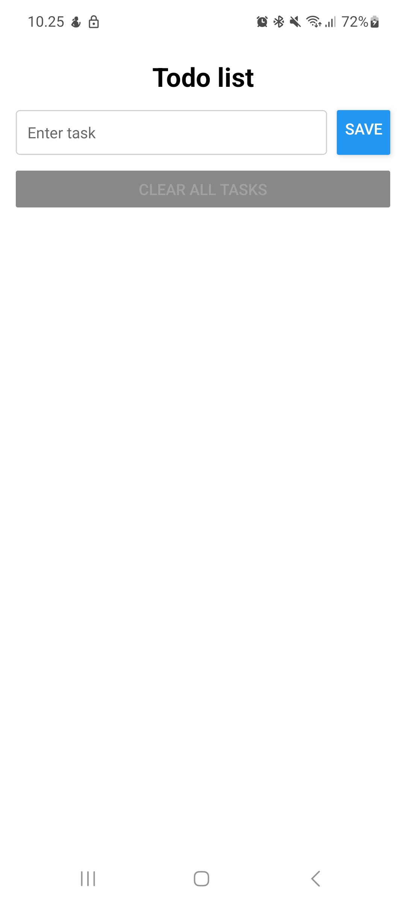
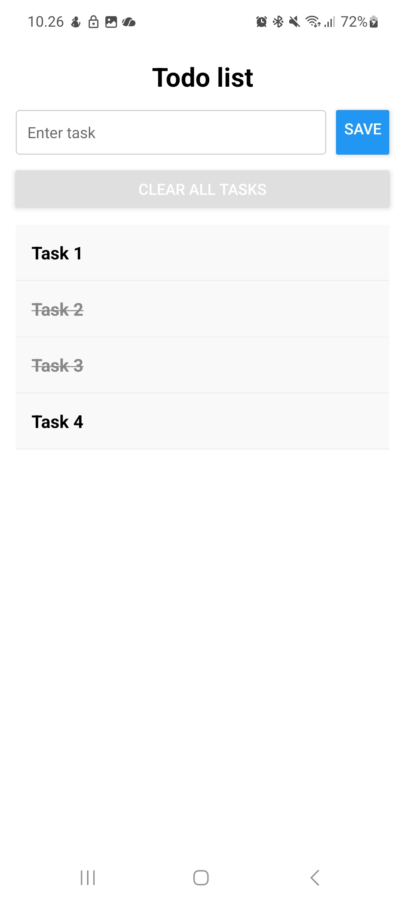
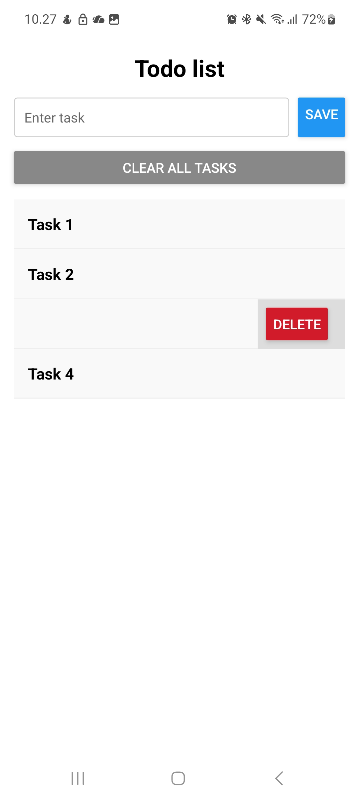
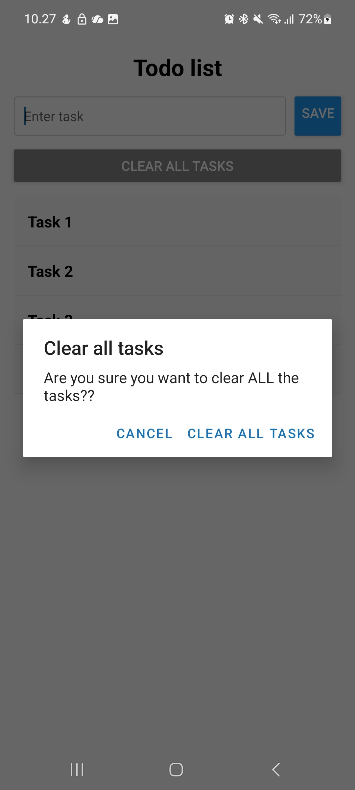

# 📝 Todo App – React Native + TypeScript

Lyhyt harjoitusprojekti, jossa toteutetaan selkeä ja toimiva todo-sovellus React Nativella.  
Käytössä TypeScript, custom hookit, AsyncStorage ja SwipeListView.

## Ominaisuudet

- Lisää uusi tehtävä
- Merkitse tehtävä valmiiksi (done / undone) napauttamalla
- Poista tehtävä pyyhkäisemällä vasemmalle ja painamalla Delete
- Tallennus ja lataus AsyncStorageen
- Tietojen poisto AsyncStoragesta
- “Clear all tasks” -painike
    - Disabloitu kun lista on tyhjä
    - Sisältää varmistusdialogin (Alert)

## Käytetyt teknologiat
- React Native (Expo)
- TypeScript
- Custom Hooks
- AsyncStorage
- react-native-swipe-list-view

## Jatkokehitys
- AppBar / Header
- Usean erillisen listan luonti
- Listojen nimeäminen
- Tehtävien ryhmittely
- Tyylien parantaminen
- Dark mode
- Drag & drop -järjestys

## Screenshots

  
  
  
  
  

